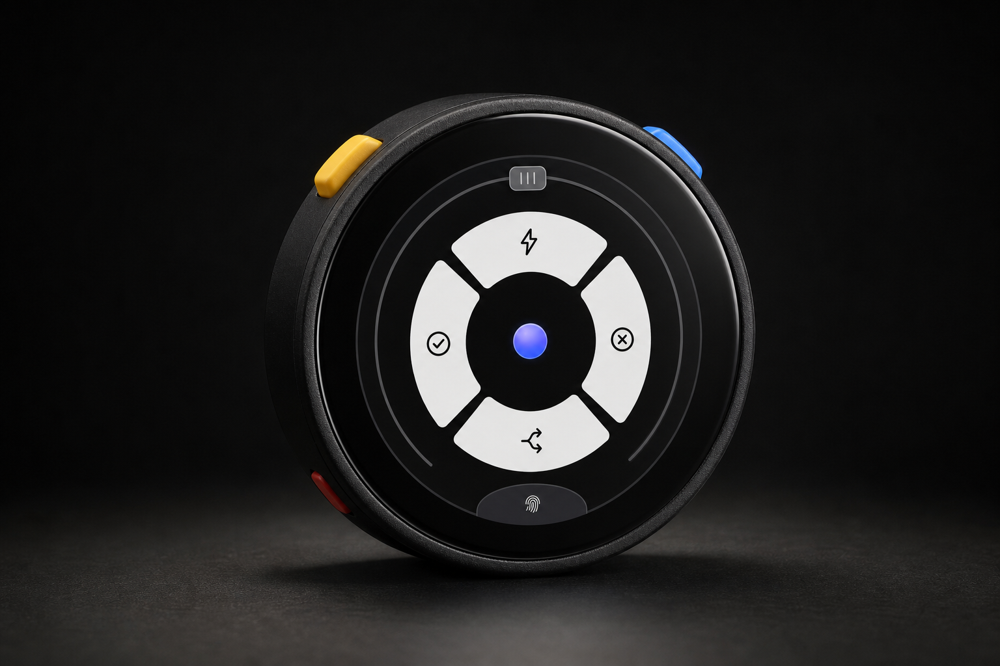
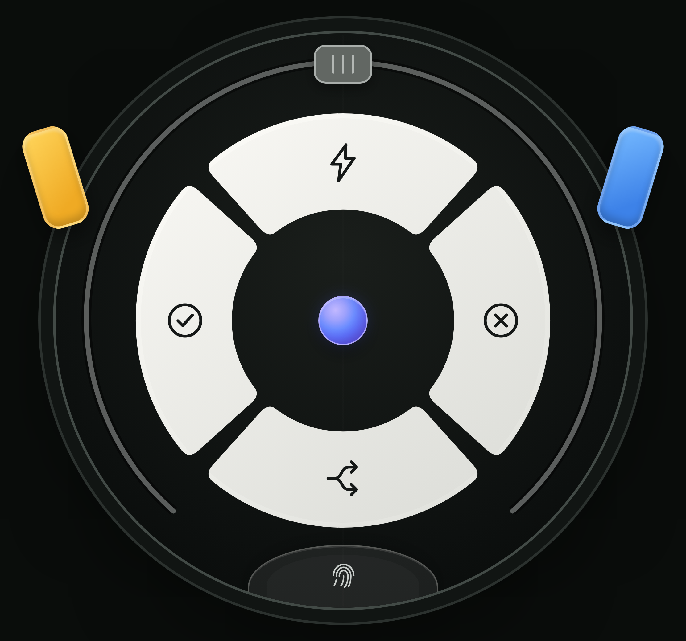

# Stopwatch Micro

Stopwatch Micro is dedicated firmware that turns the M5Stack StopWatch into an unofficial
Codex Micro-compatible controller. It boots directly into a two-page LVGL interface and keeps
Bluetooth Low Energy active as a system service; the original Mooncake launcher and demo apps are
not included.



_Concept product image generated from the project UI and the physical form shown on the
[official M5Stack StopWatch product page](https://shop.m5stack.com/products/m5stack-stopwatch-dev-kit-esp32-s3)._

> This project implements an unofficial compatibility layer for a protocol that is not a stable
> public API. A future ChatGPT update may require corresponding firmware changes.

## Interface and controls

The functional UI is locked behind the connection state. When no compatible host is connected,
the display shows the Pairing screen; a successful connection opens Command, and a disconnect
returns immediately to Pairing.

| Input | Host control | Behavior |
| --- | --- | --- |
| Command top | `ACT06` | Fast |
| Command left | `ACT07` | Approve |
| Command right | `ACT08` | Decline |
| Command bottom | `ACT09` | Fork |
| Yellow physical A | `ACT10` | Hold for host push-to-talk; release to stop |
| Blue physical B | `ACT12` | Send |
| Physical A + B | local UI | Toggle Command and Agent |
| Agent 1–6 | `AG00`–`AG05` | Select the corresponding agent/thread |
| Arc slider | `ENC_CC`, `ENC`, `ENC_CW` | Enlarged touch target; previous, press/select, next; returns to center |
| Planar joystick | `v.oai.rad` | Dead-zone-compensated Plan, Forward, Sidebar, Back |
| Bottom touch sensor | local system | Hold for 3 seconds to erase BLE bonds and restart pairing |

The Mic screen meter is driven by the StopWatch's built-in MEMS microphone. It visualizes the local
sound level only: `ACT10` starts push-to-talk with the computer's selected microphone, and the BLE
vendor HID transport does not stream StopWatch PCM audio to the host.

## Web review prototype

The reviewable HTML version of the interface lives in [`web/index.html`](web/index.html). It models
connection, page, touch, joystick, slider, and physical-key interactions without requiring the
device. The included GitHub Pages workflow can publish it at the URL below after Pages is enabled
for this private repository:



<https://xuruiray.github.io/Stopwatch-Micro/>

Command is the default preview. Use `?paired=0` to show Pairing and `?mic=1` to preview the Mic
state. The yellow and blue on-screen hardware buttons also support simultaneous A+B page switching.

GitHub Free does not currently enable Pages for private repositories. The workflow is therefore
manual-only: keep the repository private, upgrade to a plan with private-repository Pages support,
enable Pages with GitHub Actions as the source, and run **Deploy web prototype**.

## Source layout

```text
main/
├── main.cpp                         # hardware services and system-app bootstrap
├── system_config.h                  # BLE product identity and firmware version
├── debug/                           # USB Serial/JTAG diagnostic CLI
├── apps/
│   ├── app_codex_micro/             # the only application and LVGL UI
│   └── common/                      # shared key/audio helpers
└── hal/
    ├── ble/                         # HID and JSON-RPC compatibility transport
    └── ...                          # StopWatch board support
web/index.html                       # browser review prototype
docs/                                # architecture and validation notes
```

`main/CMakeLists.txt` uses an explicit source list so removed demo applications and assets cannot be
linked into the firmware accidentally.

## Build and flash

The validated toolchain is ESP-IDF v5.5.4.

```bash
python3 fetch_repos.py
source "$HOME/esp/esp-idf/export.sh"
idf.py build
idf.py -p /dev/cu.usbmodem21301 flash monitor
```

Discover the connected `/dev/cu.usb*` device first when the example port is not present. Generated
dependency and build directories are ignored by Git.

## Serial diagnostics

The firmware exposes a non-blocking, line-oriented debug CLI over the primary USB Serial/JTAG
port. Commands always start with `debug` (or `dbg`) and finish with a machine-readable result such
as `DBG RESULT command=selftest status=PASS passed=16 failed=0`.

```text
debug help
debug status
debug selftest
debug controls
debug protocol
debug ui cycle
debug transport
debug perf 3000
debug trace 30000
debug mic 2500
debug inputs 20000
debug tone 880 350
debug vibrate 500 80
debug backlight 80
```

Run the safe automated suite from the host with:

```bash
source "$HOME/esp/esp-idf/export.sh"
python3 -u tools/serial_debug_test.py --port /dev/cu.usbmodem21301
```

Add `--interactive` to include audible, haptic, physical-key, touch, and visual confirmation. Opening
the ESP32-S3 USB Serial/JTAG port may reset the board; the runner waits for a fresh `DBG READY` and
`ping` handshake before testing. `debug pairing-reset CONFIRM` is deliberately excluded because it
erases BLE bonds and restarts the device.

`debug perf` generates a safe 50 Hz neutral-joystick load and reports BLE queue depth, HID latency,
LVGL handler time, and touch-sampling gaps. For a real interaction trace, operate the physical
controls while running `python3 -u tools/serial_debug_test.py --trace-seconds 30`.

## Validation

The project has separate source-level, browser, build, and on-device checks. See
[`docs/validation.md`](docs/validation.md) for the current checklist and the distinction between
automated verification and host/device behavior that must be observed manually.

## Attribution and license

The project is distributed under the MIT License. The original board support is derived from the
M5Stack StopWatch user demo, and the compatibility transport is adapted from
[`imliubo/codex-micro-4-core2`](https://github.com/imliubo/codex-micro-4-core2). See
[`THIRD_PARTY_NOTICES.md`](THIRD_PARTY_NOTICES.md) for revision and license details.
